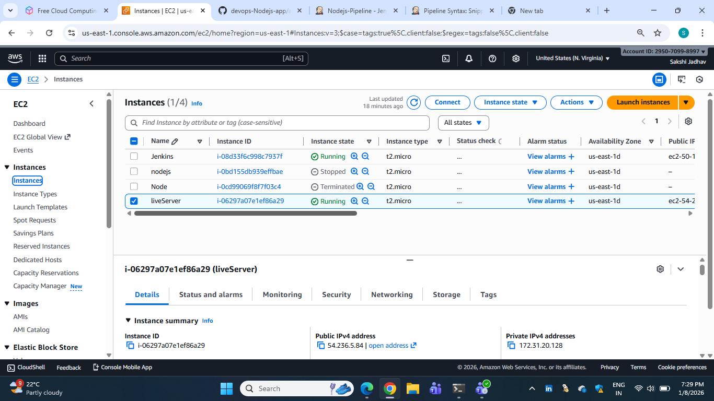
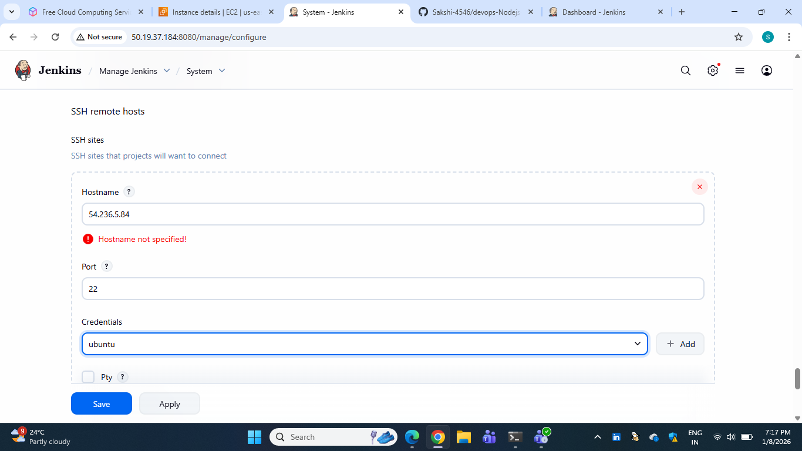
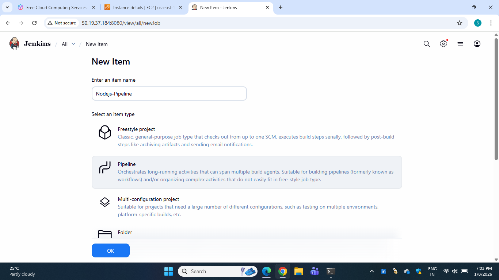
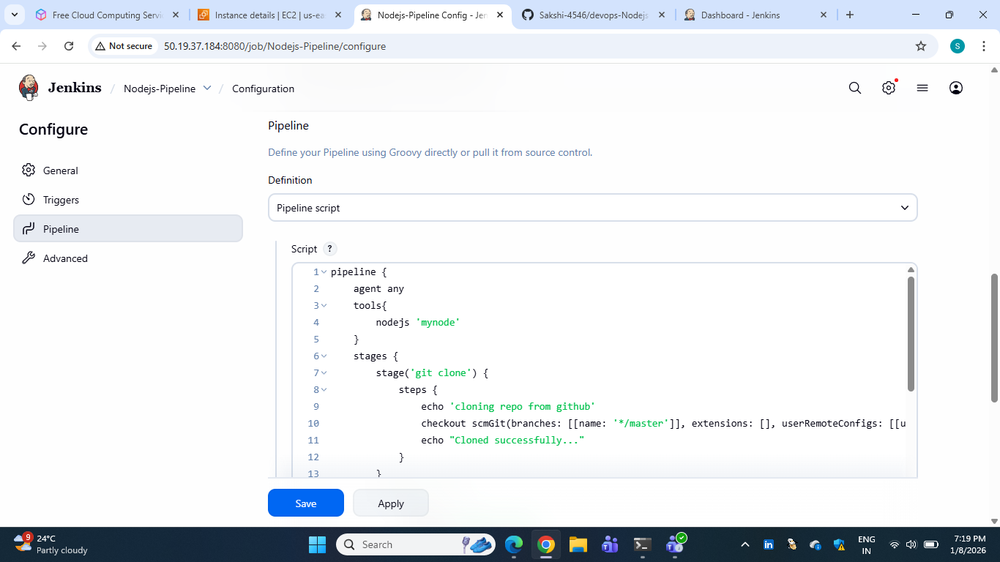
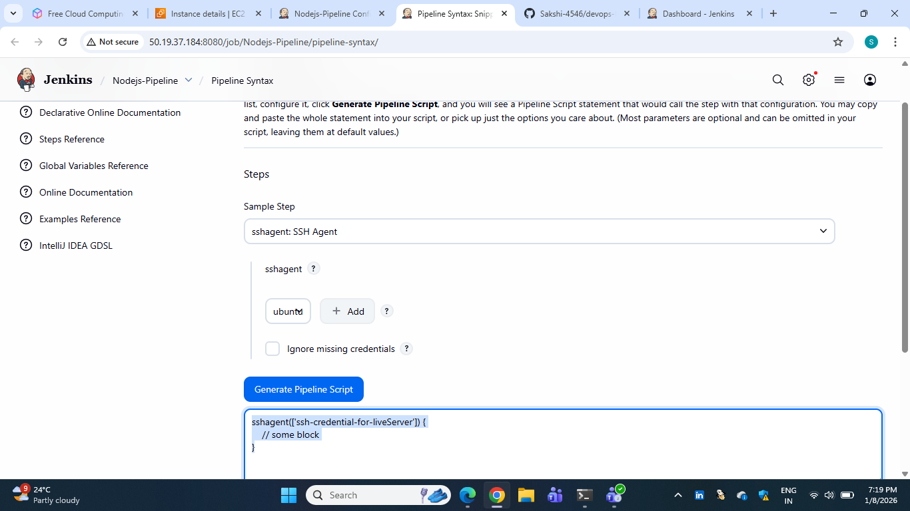
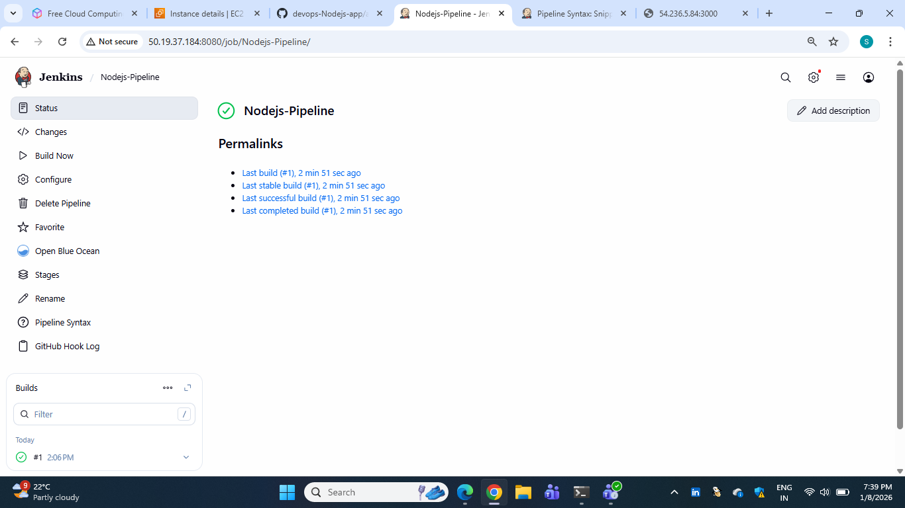
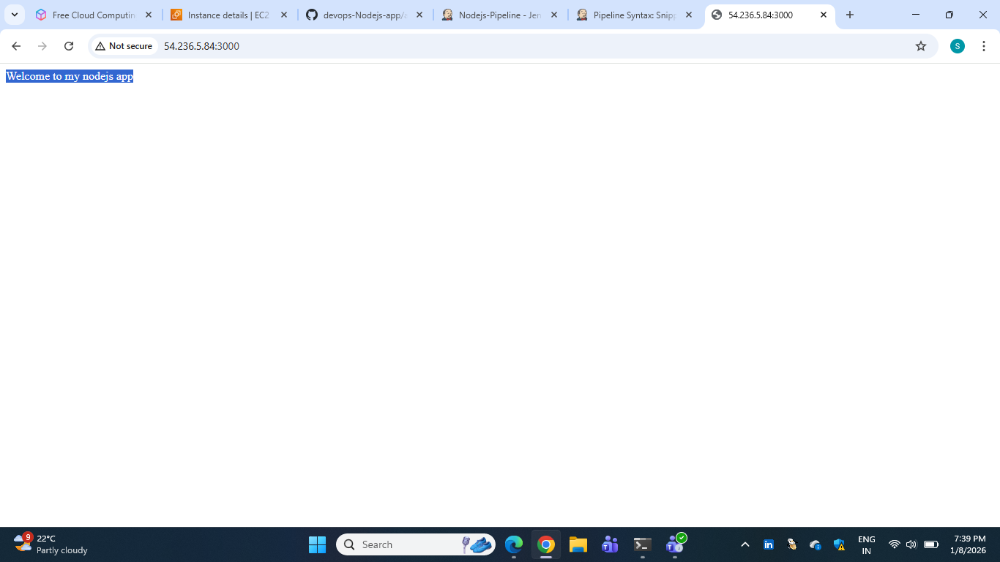

# Node.js Application Deployment on Live Server using Jenkins Pipeline
## Project Overview

This project demonstrates automatic deployment of a Node.js application to a live server using Jenkins Pipeline (Jenkinsfile).
All build, test, and deployment steps are defined only inside the Jenkinsfile.

After a successful pipeline execution, the application becomes live and can be accessed by entering the live server IP in the browser.

## Prerequisites

- Jenkins installed and running  
- SSH access to live server  
- Jenkins plugins :  
1) Git Plugin    
2) NodeJS Plugin  
3) SSH Agent Plugin

## Steps :-

### Step 1 :-  Live Server Setup

- Create a live server (EC2)
- Allow SSH access from Jenkins server  
- Add SSH credentials in Jenkins :  
Manage Jenkins → Credentials → Global
- Add public ip of live server in SSH remote host :    
Manage Jenkins → System → SSH remote host 

- Add public ip of live server in SSH remote host :    
Manage Jenkins → System → SSH remote host 

### Step 2 :- Create github repository and set webhook
- Create a GitHub repository with the following structure:

nodejs-app/  
├── package.json  
├── app.js  

- Configure a webhook so that Jenkins is triggered automatically when code is pushed.

### Step 3 :- Jenkins Job Configuration

1) Create a Pipeline Job      

2) Select Pipeline script 
 - Write jenkinsfile

### Step 4 :- Push Code to GitHub

1) Push the code to the GitHub repository

2) Verify that the Jenkins build starts automatically

### Step 5 :- Access the Application using live server public ip
- Open the Node.js port (3000) in the live server security group

### Conclusion

This setup demonstrates how a Node.js application can be fully deployed to a live server using Jenkins Pipeline, where all automation is handled in the Jenkinsfile, and the application is accessed using only the live server public IP.

